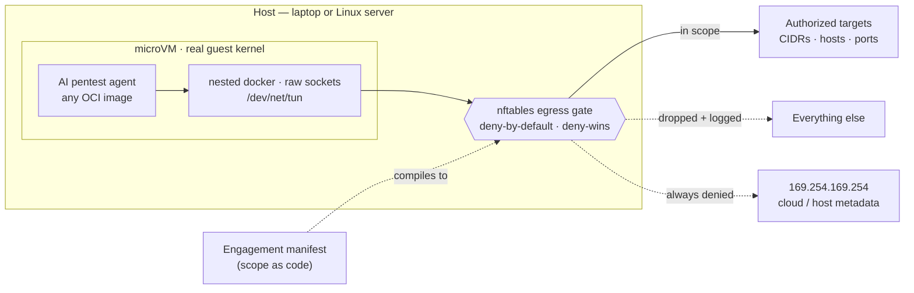
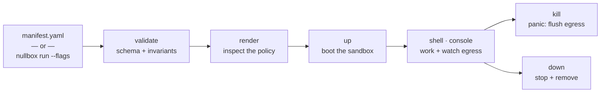
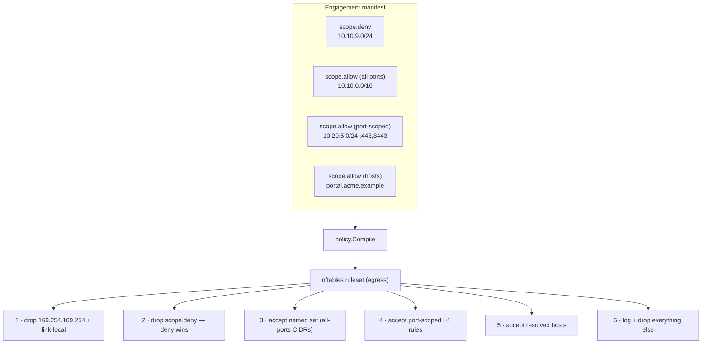
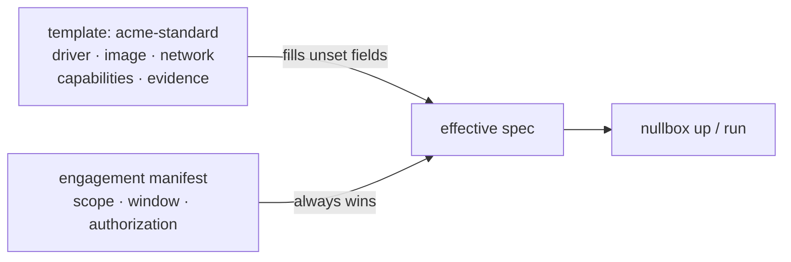

# nullbox

A sandbox for AI pentesting agents. It runs an agent inside a microVM and
**enforces engagement scope as a packet filter**, so the full network toolchain
— raw sockets, UDP, ICMP, L2 — keeps working while every destination stays
deny-by-default and explicitly authorized.

The engagement is one committed YAML file. That file *is* the authorization
record and the single source of truth: it compiles to the exact deny-by-default
egress policy the sandbox runs, and its window auto-expires so scope can never
outlive its authorization.



## Install

A Homebrew tap (available once the first release is published):

```bash
brew install JorgeCarvalhoPT/tap/nullbox
```

Or a one-line script:

```bash
curl -fsSL https://raw.githubusercontent.com/JorgeCarvalhoPT/nullbox/main/install.sh | sh
```

Or with Go (works today, no release needed):

```bash
go install github.com/JorgeCarvalhoPT/nullbox/cmd/nullbox@latest
```

From source:

```bash
git clone https://github.com/JorgeCarvalhoPT/nullbox && cd nullbox && make install
```

Then run **`nullbox`** to launch the terminal UI. (`nullbox version` prints the
build.) The script honors two env overrides: `NULLBOX_BINDIR` (install location,
default `/usr/local/bin`) and `NULLBOX_VERSION` (a specific tag, default latest).

### Uninstall

```bash
curl -fsSL https://raw.githubusercontent.com/JorgeCarvalhoPT/nullbox/main/uninstall.sh | sh
```

This removes the binary but **keeps your engagement records and evidence** —
for a pentest, that in-scope proof is worth holding on to. Add `--purge` to
also delete the state directory (`<config>/nullbox`):

```bash
curl -fsSL https://raw.githubusercontent.com/JorgeCarvalhoPT/nullbox/main/uninstall.sh | sh -s -- --purge --yes
```

If you installed with Homebrew, use `brew uninstall --cask nullbox` instead; with
Go, `make uninstall`. Stop any running sandboxes (`nullbox down <name>`) first —
uninstalling doesn't tear down live microVMs.

> Releases: `git tag vX.Y.Z && git push --tags` runs the GoReleaser workflow,
> which builds the binaries and updates the Homebrew tap. First-time setup:
> create a `JorgeCarvalhoPT/homebrew-tap` repo and add a `HOMEBREW_TAP_TOKEN`
> secret (a PAT with `repo` scope on that tap).

## Commands

Run **`nullbox`** with no arguments to launch the in-terminal UI. Everything the
UI does is also a subcommand, so it scripts cleanly.

| Command | What it does |
|---|---|
| `nullbox` | Launch the in-terminal interface (TUI). |
| `tui` | Launch the TUI explicitly. |
| `run [flags]` | Create **and** boot a sandbox in one line — no hand-written YAML. |
| `validate <manifest>` | Parse and validate a manifest, print a summary. |
| `render <manifest>` | Compile a manifest to its nftables egress policy (stdout). |
| `up <manifest>` | Provision and start the engagement sandbox, and record it. |
| `shell <name>` | Attach an interactive shell inside the sandbox. |
| `kill <name>` | Flush the egress policy immediately — the panic button. |
| `down <name>` | Stop and remove the sandbox. |
| `list` | Show known engagements and their state. |
| `console [--addr]` | Serve the web console (default `127.0.0.1:7788`). |
| `template <sub>` | Manage config presets: `list` · `show <name>` · `save <name> <manifest>`. |
| `version` | Print the version. |

`validate` and `render` work anywhere — no hypervisor required. `up`, `shell`,
`kill`, `down` dispatch to a VMM driver and need a host with that backend.
`shell`, `kill`, and `down` take the **engagement name** (from `nullbox list`),
not a manifest path.

### The one-liner: `nullbox run`

`run` is the imperative twin of `up` — it builds an engagement from flags,
validates it, and boots it, so you never have to write YAML for a quick job:

```bash
nullbox run \
  --name acme-internal \
  --auth SOW-2026-0142 \
  --allow "10.10.0.0/16 10.20.5.0/24:443,8443 portal.acme.example" \
  --deny  "10.10.9.0/24" \
  --profile routed
```

`--allow` and `--deny` take space-separated targets, each a `CIDR` or `host`,
optionally suffixed `:port,port` to scope it to those ports. Useful flags:

| Flag | Meaning |
|---|---|
| `--name` | Engagement name, a DNS label. **Required.** |
| `--auth` | Authorization reference, e.g. `SOW-2026-0142`. **Required.** |
| `--allow` | In-scope targets, space-separated. **Required.** |
| `--deny` | Out-of-scope carve-outs (deny always wins). |
| `--template` | Config preset to inherit (see `nullbox template list`). |
| `--image` | Guest OCI image — any AI pentesting agent. |
| `--driver` | `krun` · `firecracker` · `clh` · `kata` (default: auto-select for this host). |
| `--profile` | Network profile: `nat` · `routed` · `l2` (default `nat`). |
| `--days` / `--until` | Window length in days from now, or an explicit RFC3339 end. |
| `--infra` | Request the full (infra tools) guest variant. |
| `--workspace` | Host path mounted read-only as the target codebase. |
| `--save` / `--no-boot` | Also write a reusable `./<name>.yaml`; `--no-boot` writes it without booting. |

`--save` gives you the best of both worlds: a fast start now, and a committed
manifest for the audit trail.

### Lifecycle



## How it works

Scope is enforced at a **stateful packet filter (nftables) on the microVM's
egress path** — packets, not streams — so raw scans, UDP, ICMP and L2 all pass
when their destination is in scope, and everything else is dropped and logged.

- **microVM isolation** (libkrun on a laptop, Firecracker / Cloud-Hypervisor on a
  Linux host, Kata on a cluster): a real guest kernel, so the agent's nested
  docker, `/dev/net/tun` and raw sockets work unchanged.
- **nftables egress gate**, compiled from the manifest: deny-by-default,
  deny-wins, cloud metadata (`169.254.169.254`) always denied, per-target port
  scoping, and every other packet logged then dropped.
- **scope-as-code**: one committed Engagement manifest is the single source of
  truth and the authorization record; `window.end` auto-expires egress, so scope
  cannot outlive its authorization.

## The manifest is the scope

One YAML file is the single source of truth and the authorization record.
Key invariants (enforced by `model.Validate`, strict on unknown keys):

- `metadata.authorization.ref` is **required** — no anonymous scope.
- `spec.window.end` is **required** — egress auto-expires; scope cannot outlive
  authorization.
- `spec.scope.allow` must be non-empty; **deny always wins**; a port-scoped CIDR
  is restricted to those ports and is *not* also opened for all ports.
- `169.254.169.254` + link-local are denied by default (`denyMetadata`), so
  offensive tooling can't reach host/cloud credentials.
- `spec.image` names the guest — **any** AI pentesting agent's OCI image. The
  sandbox treats the agent as a black box; scope is enforced around it, not
  inside it.

A full engagement manifest:

```yaml
apiVersion: nullbox/v1
kind: Engagement
metadata:
  name: acme-internal
  client: ACME Corp
  authorization:
    ref: SOW-2026-0142            # required — no anonymous scope
    contact: security@acme.example
    signed: "2026-09-01"
spec:
  driver: firecracker             # routed => Firecracker on a Linux host
  window:
    start: "2026-09-15T00:00:00Z"
    end: "2026-09-29T23:59:59Z"   # egress auto-expires here
  network:
    profile: routed               # real raw sockets, UDP scans, ping sweeps
    denyMetadata: true            # default; never flip without an authorized IMDS test
  capabilities:
    infraTools: true              # full image (masscan, netexec, responder, arp-scan…)
  scope:
    allow:
      - cidr: 10.10.0.0/16        # the authorized range, all ports
      - cidr: 10.20.5.0/24
        ports: [443, 8443]        # a segment restricted to HTTPS only
      - host: portal.acme.example # a named host (resolved at apply time)
    deny:
      - cidr: 10.10.9.0/24        # production, out of scope (deny wins)
  evidence:
    retainFlows: true
    retainDays: 400
```

### How a manifest compiles to policy

`render` is the command to look at first — it shows the deny-by-default ruleset
the manifest becomes. Metadata is always dropped, deny-wins carve-outs come
first, all-ports CIDRs go into a named set, port-scoped CIDRs become explicit L4
rules, and everything else is logged and dropped.



Prefer flags to YAML? The same engagement, as a one-liner:

```bash
nullbox run --name acme-internal --auth SOW-2026-0142 --profile routed \
  --allow "10.10.0.0/16 10.20.5.0/24:443,8443 portal.acme.example" \
  --deny  "10.10.9.0/24" --infra --save
```

## Templates (reusable config)

Scope, window, and authorization are per-engagement, but the *setup* — driver,
guest image, network profile, capabilities, evidence retention — is usually the
same across a client or team. Save it once as a template and reference it, so
every engagement states only what is unique to it.



Save a preset from an existing manifest — it captures the config, never the
scope:

```bash
nullbox template save acme-standard ./acme-internal.yaml
nullbox template list
nullbox template show acme-standard
```

A saved template looks like this:

```yaml
name: acme-standard
driver: firecracker
image: ghcr.io/acme/pentest-agent:v1   # any AI pentesting agent's OCI image
network:
  profile: routed
capabilities:
  infraTools: true
evidence:
  retainFlows: true
  retainDays: 400
```

Then an engagement inherits it and states only what's unique:

```yaml
apiVersion: nullbox/v1
kind: Engagement
metadata:
  name: acme-q1
  client: ACME Corp
  authorization:
    ref: SOW-2026-0142
spec:
  template: acme-standard        # driver, image, network, capabilities, evidence
  window:
    end: "2026-09-29T23:59:59Z"
  scope:
    allow:
      - cidr: 10.10.0.0/16
      - cidr: 10.20.5.0/24
        ports: [443, 8443]
    deny:
      - cidr: 10.10.9.0/24
```

The manifest always wins where it sets a value; the template only fills the
fields left unset. `nullbox run --template acme-standard …` inherits a preset the
same way. Templates live under `NULLBOX_TEMPLATES` (default
`<user-config>/nullbox/templates`).

## Network profiles

| Profile | Gives you | Host |
|---|---|---|
| `nat` | routed TCP/UDP/ICMP-echo | macOS + Linux laptop (krun) |
| `routed` | full raw sockets / UDP / ICMP to CIDRs | Linux host (Firecracker) |
| `l2` | broadcast domain (arp-scan / Responder / mitm6) | Linux host on the target segment |

## Quickstart

```bash
go test ./...                             # all packages, offline
nullbox validate ./acme-internal.yaml    # parse + validate, print a summary
nullbox render   ./acme-internal.yaml    # the exact egress policy
nullbox                                   # the terminal UI

# or skip the YAML entirely:
nullbox run --name acme --auth SOW-2026-0142 --allow "10.10.0.0/16" --save
```

## Layout

```
cmd/nullbox/         CLI; bare `nullbox` launches the TUI
internal/model/      Engagement schema + validation        (stdlib only)
internal/manifest/   YAML loader
internal/policy/     manifest -> nftables compiler + host resolver  (stdlib only)
internal/template/   reusable config presets
internal/store/      engagement registry (name-based lifecycle)
internal/engage/     up/run orchestration + target parsing
internal/driver/     VMM abstraction: krun, firecracker, clh/kata stubs
internal/contract/   capability-contract generator for the guest
internal/toolrunner/ sibling tool runner (K8s Jobs / scoped containers)
internal/nflog/      NFLOG netlink reader (egress event feed)
internal/tui/        in-terminal UI (bubbletea + lipgloss)
internal/console/    web console (embedded HTML + JSON/SSE API)
```

## Status

All three phases are implemented. The pure logic is unit-tested and every path
cross-compiles for Linux; the parts that touch a hypervisor or a cluster are
driven through injected seams and table-tested against fakes, but a **live
microVM boot and a live cluster apply can only be verified on real hardware** (a
Linux/KVM host; a Kubernetes cluster with the Kata runtime + a policy-enforcing
CNI). Nothing fakes a boot it cannot perform.

Built and unit-tested off-hardware:

- **policy compiler** → nftables: deny-wins, port-scoping, the guest-egress
  `forward` chain + masquerade, and NFLOG accept/drop groups (`internal/policy`)
- **egress event decoder** (packet → FlowEvent), **engagement store**,
  **terminal UI** + **web console** with a live event stream when on Linux
- **capability-contract generator** (`internal/contract`), **Kata NetworkPolicy
  renderer** with deny-wins via `ipBlock.except`, **tool-Job renderer**
  (`internal/toolrunner`), and the firecracker / krun / kata command layers
- **CLI**: `run`, `validate`, `render`, `up`, `shell`, `kill`, `down`, `list`,
  `console`, `template`, `version`

Implemented, verified only on real hardware:

- **Phase 1** — Firecracker microVM boot (raw API over the unix socket) on
  Linux/KVM; krun/libkrun boot on a laptop; the NFLOG netlink reader (CAP_NET_ADMIN)
- **Phase 2** — the Kata driver applying manifests to a cluster
- **Phase 3** — injecting the generated contract into the guest, and the sibling
  tool runner (K8s Jobs on the cluster / scoped containers on the laptop)

### Remaining (hardware verification + hardening)

- Boot-test the Firecracker path end-to-end on Linux/KVM and confirm the
  `forward` chain drops out-of-scope guest packets (needs a guest kernel + rootfs).
- Per-engagement nft table names + TAP subnets, to allow more than one routed
  engagement per host (today the fixed table means one at a time).
- The guest↔controller `RunnerBroker` transport (vsock / unix socket) that
  carries a `ToolSpec` from the in-guest agent to the sibling tool runner.
- The `l2` profile on a bridge/netdev-family table — the inet `forward` hook does
  not see bridged L2 frames, so l2 filtering needs a bridge table (and a host on
  the target segment).
